# ZUFE教务管理系统

## 1.项目设计部分

### （1）项目总体构成

简易的教务管理系统：主要包括对老师、学生、课程的管理。

- Node.js，express框架

-  html 和 css，样式大多用 Bootstrap 

- 数据库mongodb，使用mongoose

### （2）引入的包在项目中的作用相关说明

mongoose：在nodejs中操作mongo数据库。

express：基于 Node.js 的 Web 开发框架，它有助于管理服务器端应用程序中服务器和路由之间的数据流。

express-session：保存用户登录信息在服务器上，可以判断用户登录状态。

express-art-template：把art-template模板引擎整合到express。

jquery.min.js：JavaScript常用的功能代码，提供一种简便的JavaScript设计模式，优化HTML文档操作、事件处理。

bookstrap.min.css：web开发框架。

### （3）项目目录结构和各个部分的说明

**doc：**放readme文件

**modules：**mongodb连接与数据集的创建。

**node_modules：**项目依赖，用来存放npm install下载安装的包。

**public：**存放静态资源（img、css)和引用的jquery包、bookstrap框架。

routes：存放manager、student、teacher的功能实现文件和路由文件。

views：存放manager、student、teacher的html网页文件，common下是公用的html文件。

.gitignore：注释node_modules文件不需要添加到版本管理中。

app.js：项目入口文件，程序初始运行文件。

package-lock.json：锁定当前项目包信息及项目包版本

package.json：项目信息

## 2.使用说明书

### （1）登录

在登录页面设置身份选项，根据选项值的不同，设置表单的提交路径。然后分别判断。

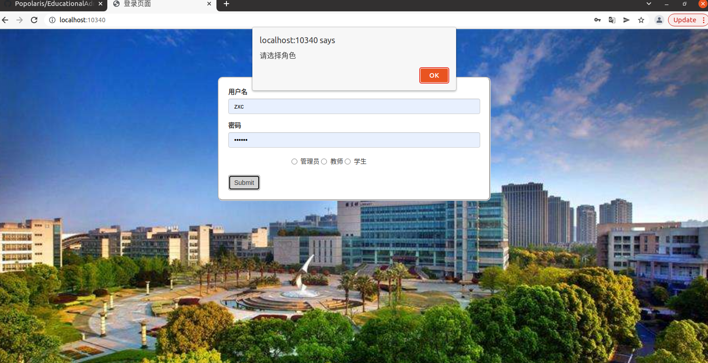

拿到用户输入的用户名和密码后，在数据库中查找检查是否正确，若正确，设置session的角色信息，转到主页。否则给出错误提示数秒后跳转回登录页面。

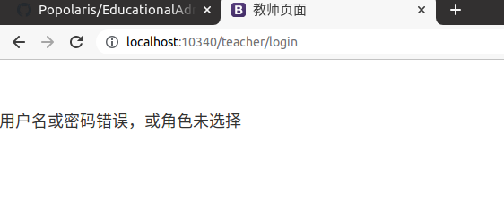

右上角logout退出。

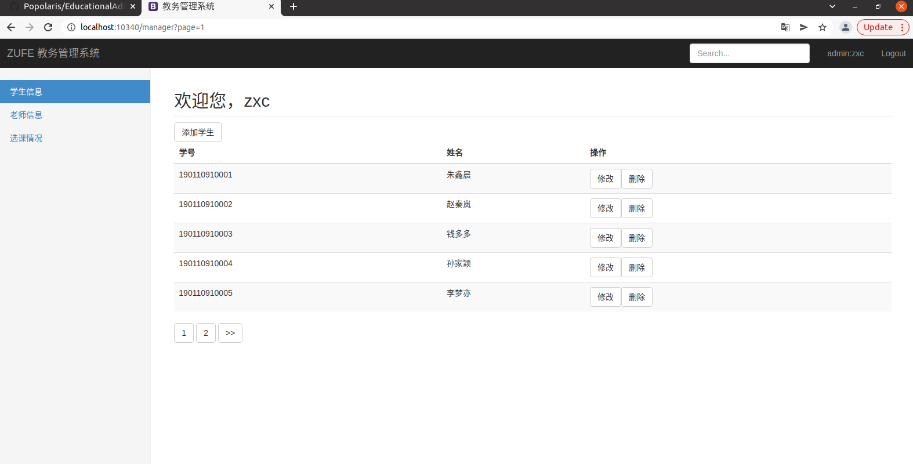

### （2）管理员功能：学生信息、老师信息、选课情况

- #### 学生信息：分页显示，可添加、修改、删除。

添加学生，不得与已添加的学生信息相同。

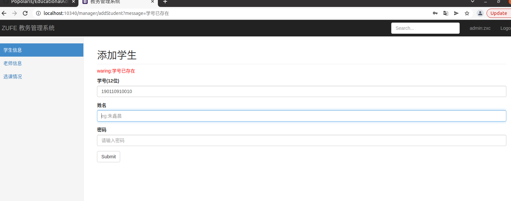

修改学生信息：包括姓名、密码、选课；学号不可修改。

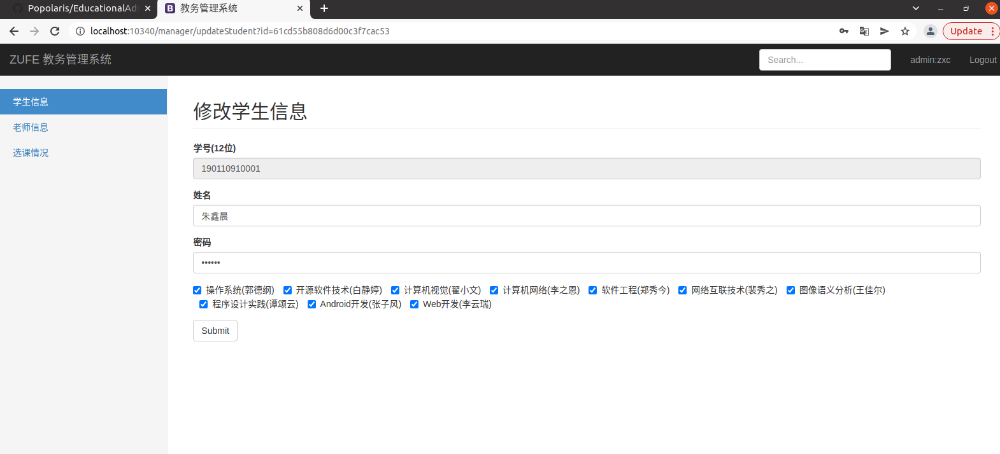

- #### 老师信息：分页显示，可添加、修改、删除。

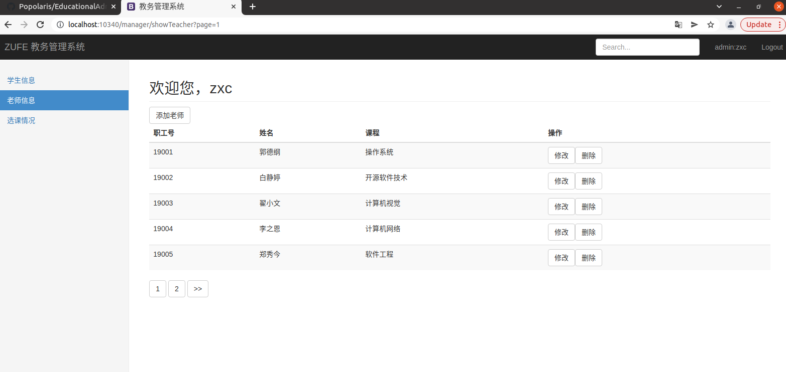

添加老师，不得与已添加的老师信息相同。

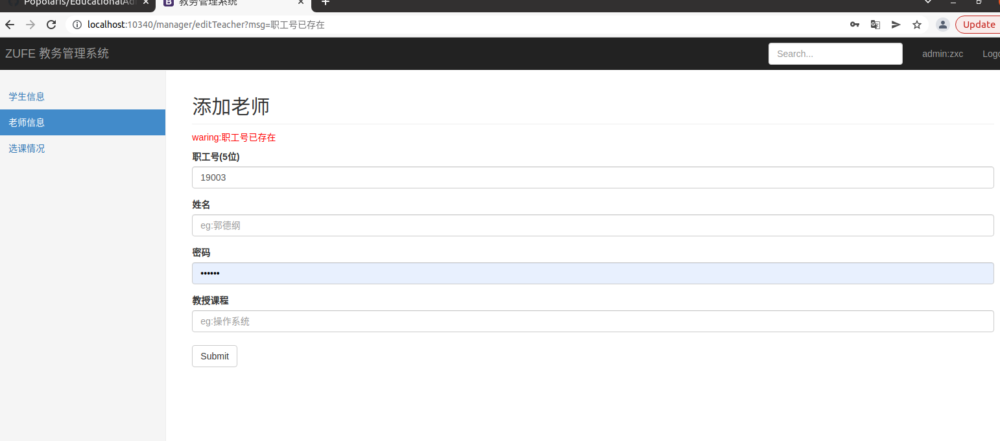

修改老师信息：包括姓名、密码；职工号和课程不能修改。

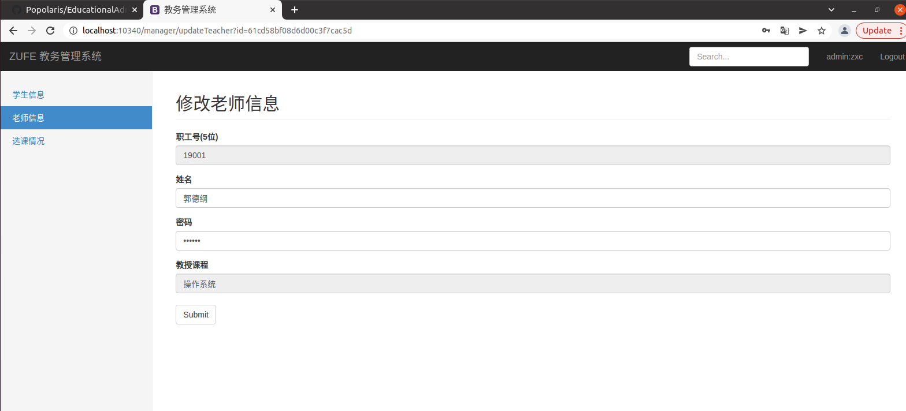

- #### 选课情况：点击上方按钮模块查看选择各课程的学生及成绩。

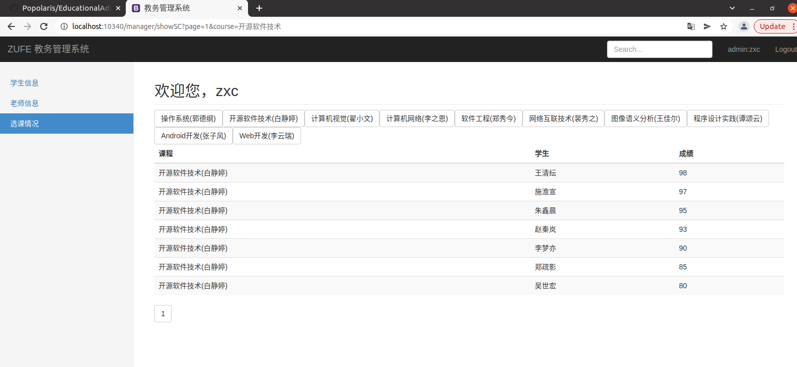

### （3）教师功能：个人信息、我的学生

- #### 个人信息：显示个人信息，可修改密码

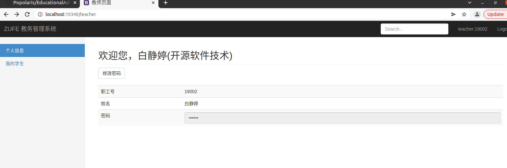

修改密码

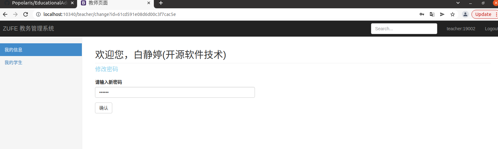

- #### 我的学生：分页显示，可录入/修改成绩

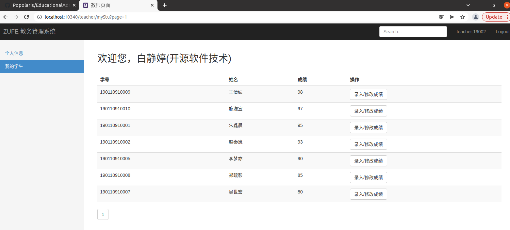

录入/修改成绩

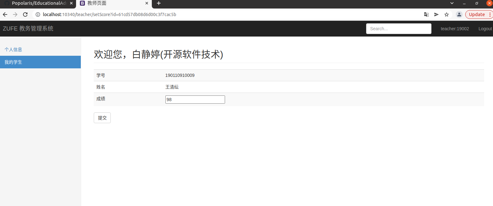

### （4）学生功能：个人信息、我的选课

- #### 个人信息：显示个人信息，可修改密码

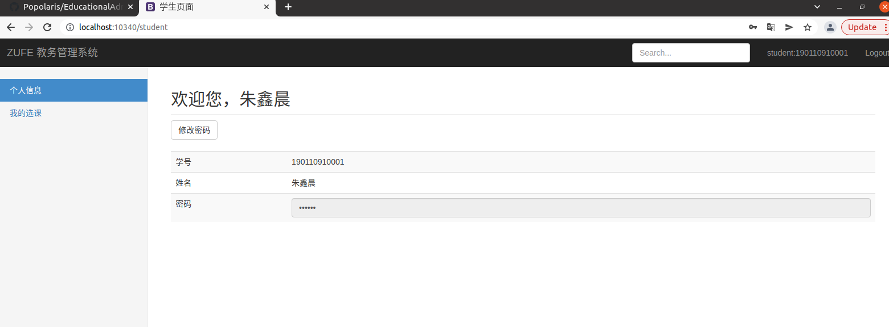

修改密码

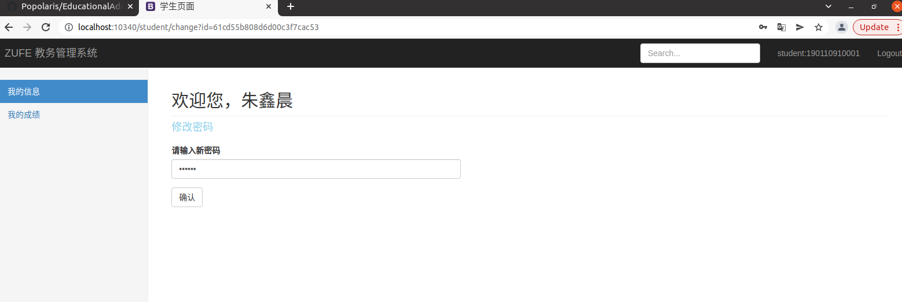

- #### 我的选课：显示我的选课和成绩，可修改选课

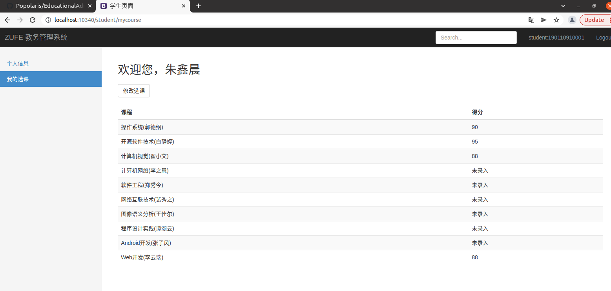

修改选课：通过复选框选择

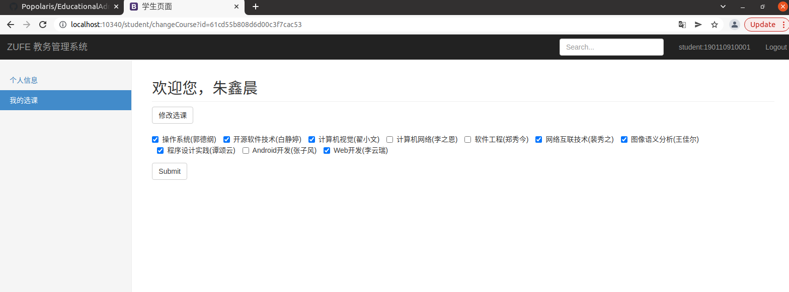

## 3）开发日记（与commit对应）

Test remote 项目提交

first commit 修改readme

second commit 没太大的变化

third commit  网页 数据集

forth commit 数据库 网页 readme
